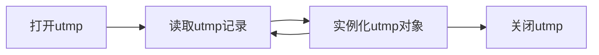

## Man Who

阅读`who`的联机帮助：

```shell
man who
```

通过阅读联机帮助，发现已登录的用户信息放在`/var/run/utmp`或者`/var/log/wtmp`中。

搜索联机帮助：

```shell
man -k utmp
man -k wtmp
```

返回的是：

```shell
utmp (5)             - 登录记录（login records）
wtmp (5)             - login records
```

阅读`utmp`的联机帮助：

```shell
man 5 utmp
```

可以发现文件中保存的是结构数组，数组元素是utmp类型的结构。

## UTMP

### utmp

`UTMP_FILE`的定义在`/usr/include/utmp.h`中。

```c
/* utmp.h */
/* Compatibility names for the strings of the canonical file names.  */
#define UTMP_FILE _PATH_UTMP
#define UTMP_FILENAME _PATH_UTMP
#define WTMP_FILE _PATH_WTMP
#define WTMP_FILENAME _PATH_WTMP
```

其中，变量`_PATH_UTMP`和`_PATH_WTMP`的定义在`/usr/inlcude/paths.h`中。

```c
#define	_PATH_UTMP	"/var/run/utmp"
#define	_PATH_WTMP	"/var/log/wtmp"
```

所以，`UTMP_FILE`即为`/var/run/utmp` ，注意此文件不是文本文件，无法直接读取。

`struct utmp`的定义在`/usr/include/utmp.h`中。

```c
struct utmp {
       short int ut_type; /* type of login */
       pid_t ut_pid; /* pid of login process */
       char ut_line[UT_LINESIZE]; /* device name of tty - "/dev/" */
       char ut_id[4]; /* init id or abbrev. ttyname */
       char ut_user[UT_NAMESIZE]; /* user name */
       char ut_host[UT_HOSTSIZE]; /* hostname for remote login */
       struct exit_status ut_exit; 
       /* The exit status of a process marked as DEAD_PROCESS. */
       long int ut_session; /* session ID, used for windowing*/
       struct timeval ut_tv; /* time entry was made. */
       int32_t ut_addr_v6[4]; /* IP address of remote host. */
       char pad[20]; /* Reserved for future use. */
};
//注意有一行宏定义
/* Backwards compatibility hacks.  */
#define ut_name		ut_user
//因此也可以使用ut_name作为登录用户名的别名
```

### exit_status

`struct exit_status`的定义在`/usr/include/utmp.h`中。

```c
struct exit_status
{
    short int e_termination;	/* Process termination status.  */
    short int e_exit;		/* Process exit status.  */
};
```

### timeval


## Implement

略过介绍性的内容，utmp结构包含8个成员变量，而who命令使用到的是下面4个：

1. ut_user 登录名
2. ut_line 设备名
3. ut_time 登录时间
4. ut_host 登录的远程计算机名字

思路：



### File API

已经知道getc和fgets函数可以从文件中读取字符或字符串，但读取数据结构中的信息效率太低。

寻求联机帮助手册：

```c
man -k file | grep read
```

```c
man 2 read
```

由此可知，通过`open()`，`read()`，`close()`三个系统调用从`utmp`文件中取得用户登录信息。

#### open

open的基本用法：

1. 目标：打开一个文件
2. 头文件：`#include<fcntl.h>`
3. 函数原型：`int fd = open(char * name,int how)`
4. 参数：
   1. name 文件名
   2. how 只读`O_RDONLY`，只写`O_WRONLY`，可读可写`O_RDWR`
5. 返回值：-1表示错误，int表示成功返回。

打开后返回的正整数叫文件描述符，通过该唯一标识建立进程和文件之间的连接。不同的文件打开的文件描述符不同，同一文件的不同打开对应的文件描述符也不同。

#### read

read的基本用法：

1. 目标：把数据读取到缓冲区

2. 头文件：`#include<unistd.h>`

3. 函数原型：`ssize_t numread = read(int fd,void * buf,size_t qty)`

   有关`ssize_t`和`size_t`见于stddef.h中。

   在32位系统中长度为4个字节：

   1. `typedef unsigned int size_t;`
   2. `typedef signed int ssize_t;`

   在64位系统中长度为8个字节：

   1. `typedef unsigned long size_t;`
   2. `typedef signed int ssize_t;`

4. 参数：

   1. fd 文件描述符
   2. buf 用来存放数据的目的缓冲区
   3. qty 要读取的字节数

5. 返回值：-1表示错误，numread表示成功读取的字节数。

如果要求读取的字符超出了文件的长度，则numread返回0。

#### close

close的基本用法：

1. 目标：关闭一个文件
2. 头文件：`#include<unistd.h>`
3. 函数原型：`int result = close(int fd)`
4. 参数：fd 文件描述符
5. 返回值：-1表示错误，0表示成功关闭。

### Programming

根据思路，编写代码如下：

```c
/*
 * who.c 首次实现版本，通过读取utmp文件展示结果实现who功能
 */
#include<stdio.h>
#include<utmp.h>
#include<fcntl.h>//open()
#include<unistd.h>//read(),close()
#define SHOWHOST//用于包含输出远程主机的登录
void show_info(struct utmp * utmpbufferprint);
int main()
{
    struct utmp current_record;//实例化的"对象"，将读出的数据赋给它
    int utmpfd;//文件描述符
    int reclen=sizeof(current_record);//该结构的长度
    if((utmpfd=open(UTMP_FILE,O_RDONLY))==-1)//UTMP_FILE是utmp.h中的宏定义
    {
        perror(UTMP_FILE);
        //perror(s)用来将上一个函数发生错误的原因输出到标准设备(stderr)。
        //参数 s 所指的字符串会先打印出，后面再加上错误原因字符串。
        exit(1);//以异常情况退出
    }
    //current_record是utmp类型，取地址运算符后是utmp*类型
    //reclen保证每次读一个结构体长度的数据
    //判断是否与结构体长度相等，当需读取长度大于当前文件长度时（只可能发生在最后一次读取）抛弃本次读取
    while(read(utmpfd,&current_record,reclen)==reclen)//循环打印，确保所有用户都列出
    {
        show_info(&current_record);
    }
    close(utmpfd);
    return 0;
}
```

显示登录信息函数：

```c
int show_info(struct utmp * utmpbufferprint){
    printf("%-8.8s",utmpbufferprint->ut_name);
    /*
     * 1.ut_name 扩展到 ut_user 见前文
     * 2.-代表左对齐，+代表右对齐
     * 3.8代表字符宽度的最小值
     * 4.".8"代表将要打印的字符的最大数目
     * 通过限制打印的最小值和最大值保证输出字符串长度为8
     */
    printf(" ");
    printf("%-8.8s",utmpbufferprint->ut_line);
    printf(" ");
    showTime(utmpbufferprint->ut_time);
    printf(" ");
#ifdef SHOWHOST
    if(utmpbufferprint->ut_host[0]!='\0')//检查ut_host字符串是否为空
        printf("(%s)",utmpbufferprint->ut_host);
#endif
    printf("\n");
    return 0;

}
```

## Improvement

系统所带的who命令只列出已登录用户的信息，而上述代码还会显示其他的信息。

简单的思路是过滤掉用户名为空的记录，但是有些记录用户名为LOGIN，这显然不是一个真实的用户。因此需要更加详细地区分用户类型。

### ut_type

`ut_type`在`/usr/include/utmp.h`中定义：

```c
/* Values for the `ut_type' field of a `struct utmp'.  */
#define EMPTY		0	/* No valid user accounting information.  */
 
#define RUN_LVL		1	/* 系统的运行级别 The system's runlevel.  */
#define BOOT_TIME	2	/* 系统启动时间 Time of system boot.  */
#define NEW_TIME	3	/* 系统时钟改变后的时间 Time after system clock changed.  */
#define OLD_TIME	4	/* 系统时钟改变的时间 Time when system clock changed.  */
 
#define INIT_PROCESS	5	/*由init进程生成的进程 Process spawned by the init process. */
#define LOGIN_PROCESS	6	/* Session leader of a logged in user.  */
#define USER_PROCESS	7	/* Normal process.  */
#define DEAD_PROCESS	8	/* 终止进程 Terminated process.  */
 
#define ACCOUNTING	9
```

由该结构可知，当ut_type的值为7(USER_PROCESS)的时候，表明它是已经登录的用户。

对原程序做如下的修改：

```c
void show_info(struct utmp * utbufferprint){
    if(utbufferprint->ut_type!=USER_PROCESS)
        return;
    //以下是原来的代码
    //...
}
```

### timeval

接下来要以正确的格式显示时间。

```shell
man -k time | grep -i transform
man -k time | grep -i convert
```

其中，`-i`是忽略大小写差异。

Linux时间存储方式是`time_val`数据类型。以整数表示，数值是从1970年1月1日0时至今的总秒数，

在`/usr/include/sys/time.h`中包含了头文件`/usr/include/bits/types/struct_timeval.h`

`struct timeval`的定义在该头文件中。

```c
struct timeval{
    __time_t tv_sec;/* Seconds 秒 */
    __suseconds_t tv_usec;/* Microseconds 微秒 */
};
```


```
typedef __time_t time_t;
```

一般由函数`int gettimeofday(struct timeval *tv, struct timezone *tz)`获取系统的时间

在源代码中使用了`ctime()`是因为`utbufp->ut_time`的值是距离1970.1.1的秒数总和，是长整形，要把其转换为易读的时间格式。

